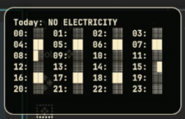
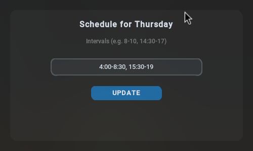

# waybar electricity scheduler

Модуль для Waybar, який відображає час до наступного переключення режиму подачі електроенергії.

Показує підказку з графіком подачі.

По кліку на віджет відкривається форма для вказання інтервалів часу зі світлом з точністю до півгодини (приймає через кому формати: HH-HH, HH:MM-HH:MM: наприклад 10-12, 14:30-16:30).

## скріншоти





## встановлення

Все відбувається в `~/.config/waybar`.

Відредагуйте шляхи відповідно до ваших налаштувань.

Потім додайте до `~/.config/waybar/config,jsonc`:
```
{
  "include": [
  // other modules
  "modules/electricity.jsonc",
  ]
}
```
Додайте `customtkinter` (встановіть через AUR або pip install).

Зробіть скрипти виконуємими:
```
chmod +x ~/.config/waybar/modules/electricity_status.py
chmod +x ~/.config/waybar/modules/set_electricity_status.py
```

Додайте `"custom/electricity_timer"` до вашого waybar layout.

Перезапустіть Waybar.

---

# English

A module for Waybar that displays the time until the next power supply mode switch.

Shows a tooltip with the power supply schedule.

Clicking on the widget opens a form for specifying time intervals with light with an accuracy of up to half an hour (accepts comma-separated formats: HH-HH, HH:MM-HH:MM: for example 10-12, 14:30-16:30).

## screenshots


## installation

Everything happens in `~/.config/waybar`.

Edit the paths according to your settings.

Then add to `~/.config/waybar/config,jsonc`:
```
{
"include": [
// other modules
"modules/electricity.jsonc",
]
}
```
Add `customtkinter` (install from AUR or pip install).

Make the scripts executable:
```
chmod +x ~/.config/waybar/modules/electricity_status.py
chmod +x ~/.config/waybar/modules/set_electricity_status.py
```

Add `"custom/electricity_timer"` to your waybar layout.

Restart Waybar.
